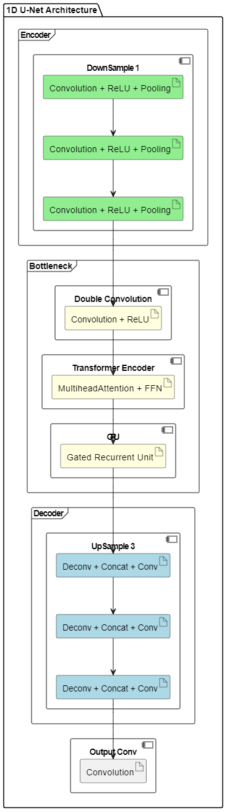

# Child-Mind-Institute: Detect Sleep States - Kaggle Competition
## Overview
This repository is dedicated to the "Child-Mind-Institute - Detect Sleep States" Kaggle competition. The primary goal of this competition is to develop algorithms capable of detecting onset and wake-up events from accelerometer data.

## Results
Private score: 0.752
Public score: 0.706

